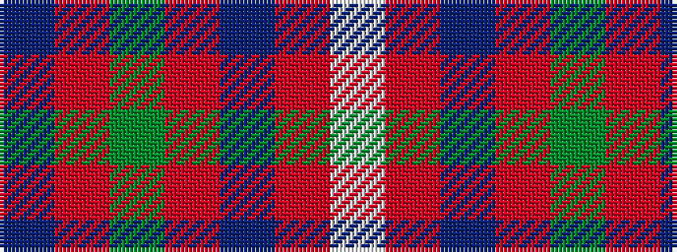

BRGRBRW

It is a 7 stripe tartan.

<figure class="pat-woven">

<figcaption>idealised sample</figcaption>
</figure>

## Colour Sequence



## Tartans with this colour sequence

| Tartans |
|---------------|
| [Geddes](/setts/s7/dp1r5g15r3dp9r10w1~x4/)|
||
| [MacKintosh Geddes](/setts/s7/db1r5dg18r4db9r10w1~x4/)|
||
| [MacKintosh, Geddes](/setts/s7/db1r5g18r4db9r10w1~x4/)|
||
| [MacKintosh-Geddes (Personal?)](/setts/s7/dp2r4g12r3dp6r10w2~x2/)|
||
