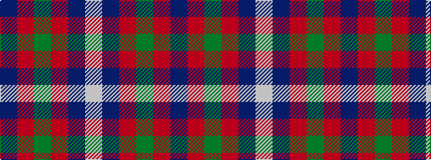

BRGRBW

It is a 6 stripe tartan.

<figure class="pat-woven">

<figcaption>idealised sample</figcaption>
</figure>

## Colour Sequence



## Tartans with this colour sequence

| Tartans |
|---------------|
| [Edinburgh Bus Company (Corporate)](/variants/s6/db3r2g5r8db12w3~x2/)|
||
| [Lothian Buses (Corporate?)](/variants/s6/w2db15r3g3r3db1~x8/)|
||
