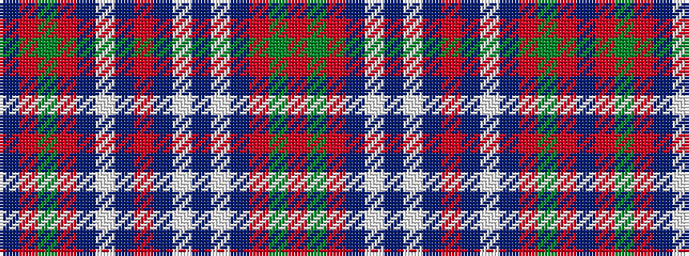

BRGRBWBRBWBWBRGR

It is a 16 stripe tartan.

<figure class="pat-woven">

<figcaption>idealised sample</figcaption>
</figure>

## Colour Sequence



## Tartans with this colour sequence

| Tartans |
|---------------|
| [Chisholm](/variants/s16/r5g16r5db4w2db4w2db4r22db4w2db4r5g16r5db2~x4/)|
||
