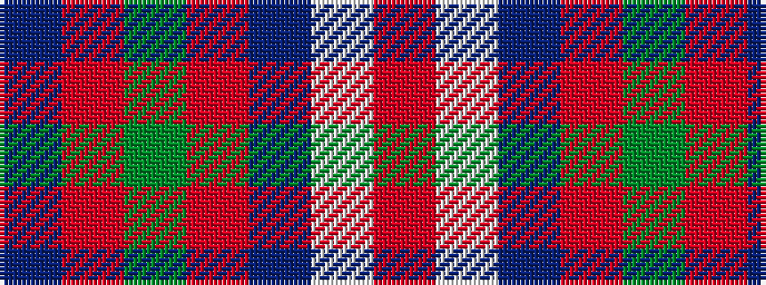

BRGRBWR

It is a 7 stripe tartan.

<figure class="pat-woven">

<figcaption>idealised sample</figcaption>
</figure>

## Colour Sequence



## Tartans with this colour sequence

| Tartans |
|---------------|
| [MacKintosh (Artefact)](/setts/s7/r5w36dp14r9g28r8dp2~x2/)|
||
| [MacKintosh, Arisaid](/setts/s7/r5w36p14r9g28r8p2~x2/)|
||
