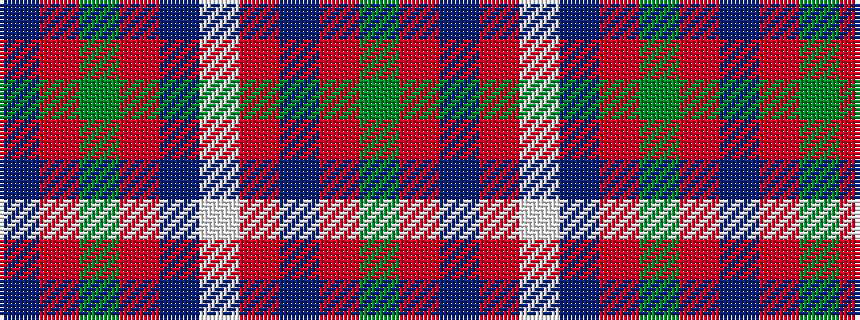

BRGRBWRBRG

It is a 10 stripe tartan.

<figure class="pat-woven">

<figcaption>idealised sample</figcaption>
</figure>

## Colour Sequence



## Tartans with this colour sequence

| Tartans |
|---------------|
| [MacDonell of Keppoch](/setts/s10/dg2r2db1r24lb1db6r3dg12r4db1/)|
||
