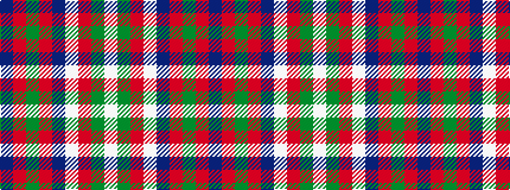

BRGRBWRGW

It is a 9 stripe tartan.

<figure class="pat-woven">

<figcaption>idealised sample</figcaption>
</figure>

## Colour Sequence



## Tartans with this colour sequence

| Tartans |
|---------------|
| [Robertson, dress](/variants/s9/db24r4g24r4db4w20r10g3w4~x2/)|
||
