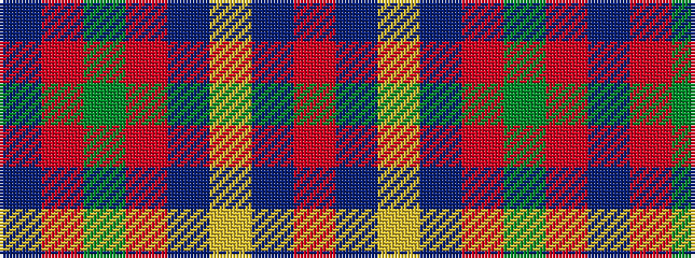

BRGRBYBR

It is a 8 stripe tartan.

<figure class="pat-woven">

<figcaption>idealised sample</figcaption>
</figure>

## Colour Sequence



## Tartans with this colour sequence

| Tartans |
|---------------|
| [Chisholm](/tartans/r12n2lr1n2r3dg8r3n1/)|
||
