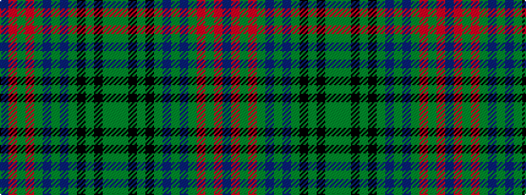

BRGRGBGBGKGKGG

It is a 14 stripe tartan.

<figure class="pat-woven">

<figcaption>idealised sample</figcaption>
</figure>

## Colour Sequence



## Tartans with this colour sequence

This pattern is a design lineage: every tartan below shares one colour order, whatever its owner —
near-identical designs are grouped, the largest lineage first (#112: the pattern is a tartan's
second parent, beside its family or clan).

<table class="sett-table">
<tbody>
<tr><td><a href="/variants/s14/db10r5g5r5g60db13g10dbi67g5k5g5k5g13y10~db1106275-dbi1204274/">Beatrice Princess.. (Hunting) Royal Family Tartan</a></td></tr>
<tr><td class="sett-swatch"></td></tr>
<tr class="cluster-sep"><td></td></tr>
<tr><td><a href="/variants/s14/db6r3g3r3g36b6g6db40g3k3g3k3g8y6~x2/">Princess Beatrice Hunting (MacKinlay strip)</a></td></tr>
<tr><td class="sett-swatch"></td></tr>
</tbody>
</table>

