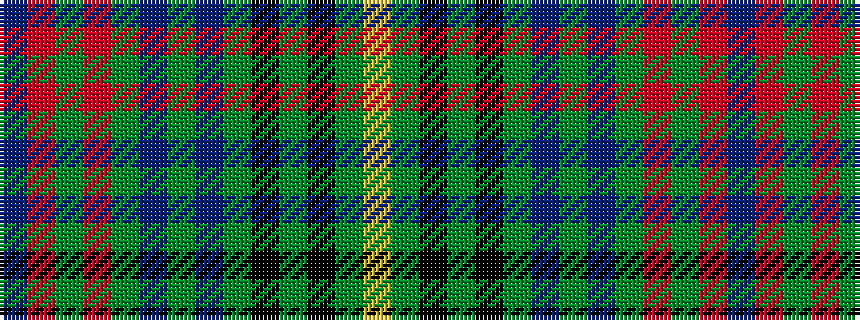

BRGRGBGBGKGKGY

It is a 14 stripe tartan.

<figure class="pat-woven">

<figcaption>idealised sample</figcaption>
</figure>

## Colour Sequence



## Tartans with this colour sequence

| Tartans |
|---------------|
| [Beatrice Princess.. (Hunting) Royal Family Tartan](/variants/s14/dbi10r5g5r5g60dbi13g10db67g5k5g5k5g13ly10/)|
||
| [Princess Beatrice Hunting (MacKinlay strip)](/variants/s14/db6r3g3r3g36dbi6g6db40g3k3g3k3g8ly6~x2/)|
||
