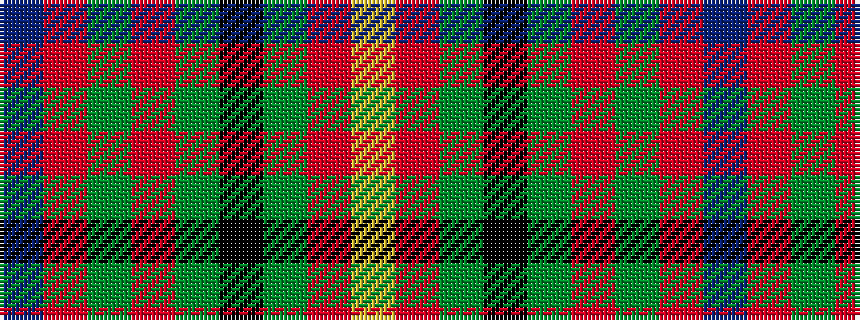

BRGRGKGRY

It is a 9 stripe tartan.

<figure class="pat-woven">

<figcaption>idealised sample</figcaption>
</figure>

## Colour Sequence



## Tartans with this colour sequence

| Tartans |
|---------------|
| [Australia Dress](/variants/s9/lr11r4y2k4y2r4y12r20t2~x2/)|
||
