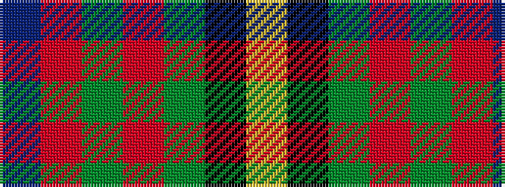

BRGRGKY

It is a 7 stripe tartan.

<figure class="pat-woven">

<figcaption>idealised sample</figcaption>
</figure>

## Colour Sequence



## Tartans with this colour sequence

| Tartans |
|---------------|
| [Scout Mapping Service #1 (Corporate)](/setts/s7/db24r8g8r2g8k1ly2~x2/)|
||
