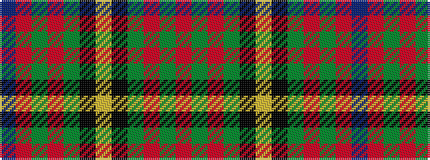

BRGRGKYKGRGR

It is a 12 stripe tartan.

<figure class="pat-woven">

<figcaption>idealised sample</figcaption>
</figure>

## Colour Sequence



## Tartans with this colour sequence

| Tartans |
|---------------|
| [Scout Mapping Service](/setts/s12/db24ri8gi8r2g8k1ly2~x2/)|
||
