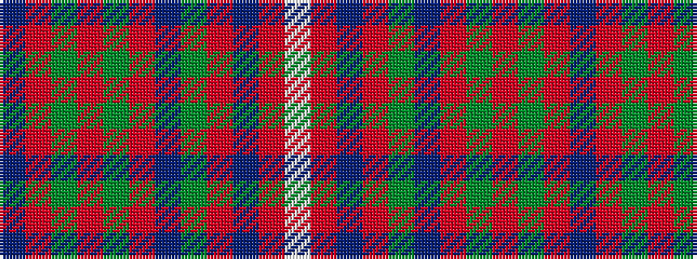

BRGRGRBGRBRW

It is a 12 stripe tartan.

<figure class="pat-woven">

<figcaption>idealised sample</figcaption>
</figure>

## Colour Sequence



## Tartans with this colour sequence

| Tartans |
|---------------|
| [Wcwm 9275-1446](/setts/s12/db56r1g4r1g3r1db10g1r10db2r3lb2~x4/)|
||
