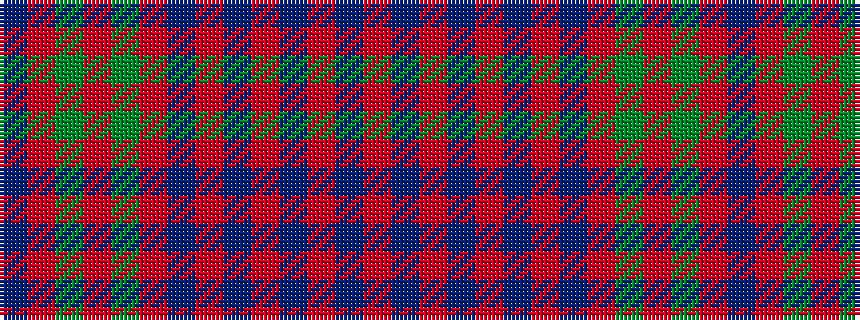

BRGRGRBRBRBRBR

It is a 14 stripe tartan.

<figure class="pat-woven">

<figcaption>idealised sample</figcaption>
</figure>

## Colour Sequence



## Tartans with this colour sequence

| Tartans |
|---------------|
| [Culloden Unidentified](/setts/s14/db3r3dg50r3dg1r3db3r3db45r3db3r50db3r3~x2/)|
||
| [Culloden, Unidentified](/setts/s14/db3r3g50r3g1r3db3r3db45r3db3r50db3r3~x2/)|
||
