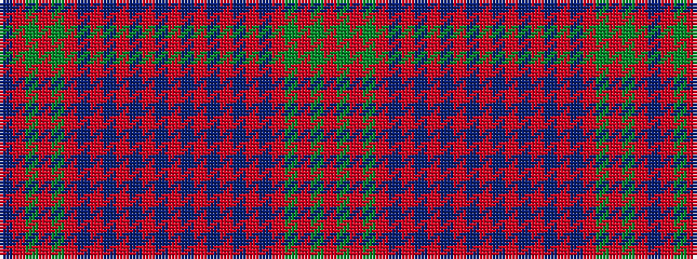

BRGRGRBRBRBRBRBRBRBRBRGRGR

It is a 26 stripe tartan.

<figure class="pat-woven">

<figcaption>idealised sample</figcaption>
</figure>

## Colour Sequence



## Tartans with this colour sequence

| Tartans |
|---------------|
| [Not Specified](/setts/s26/r3g50r3g1r3t3r3t45r3t3r50t3r3t3r50t3r3t45r3t3r3g1r3g50r3t3~x2/)|
||
