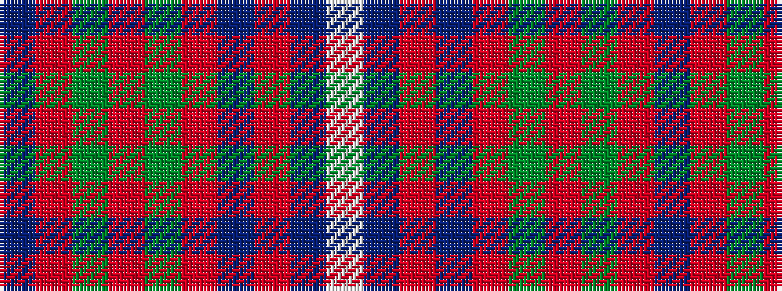

BRGRGRBRBW

It is a 10 stripe tartan.

<figure class="pat-woven">

<figcaption>idealised sample</figcaption>
</figure>

## Colour Sequence



## Tartans with this colour sequence

| Tartans |
|---------------|
| [Jenkins (Name)](/setts/s10/db2r30g8r3g8r6db4r3db12w2~x2/)|
||
