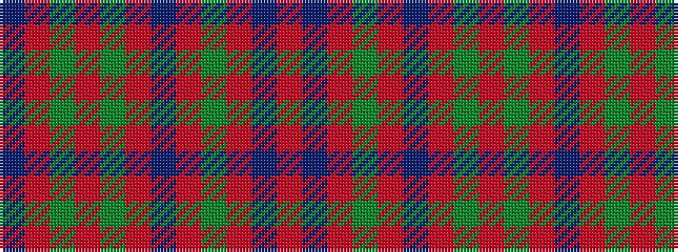

BRGRGRBRGRBR

It is a 12 stripe tartan.

<figure class="pat-woven">

<figcaption>idealised sample</figcaption>
</figure>

## Colour Sequence



## Tartans with this colour sequence

| Tartans |
|---------------|
| [Unidentified Cant #14](/variants/s12/db80r56dg3r56dg88r64db3r4dg3r4db3r64/)|
||
