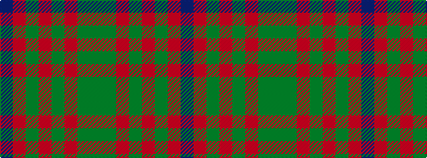

BRGRGRGG

It is a 8 stripe tartan.

<figure class="pat-woven">

<figcaption>idealised sample</figcaption>
</figure>

## Colour Sequence



## Tartans with this colour sequence

| Tartans |
|---------------|
| [John Muir Way](/variants/s8/dy35dg19r3y8r3dg8r3t3~x2/)|
||
| [John Muir Way](/variants/s8/dy35dg19r3g8r3dg8r3db3~x2/)|
||
