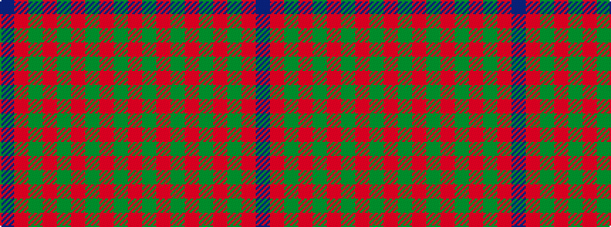

BRGRGRGRGR

It is a 10 stripe tartan.

<figure class="pat-woven">

<figcaption>idealised sample</figcaption>
</figure>

## Colour Sequence



## Tartans with this colour sequence

| Tartans |
|---------------|
| [Nithsdale](/tartans/db10r2g2r6g16r1g2r1g3r6/)|
||
