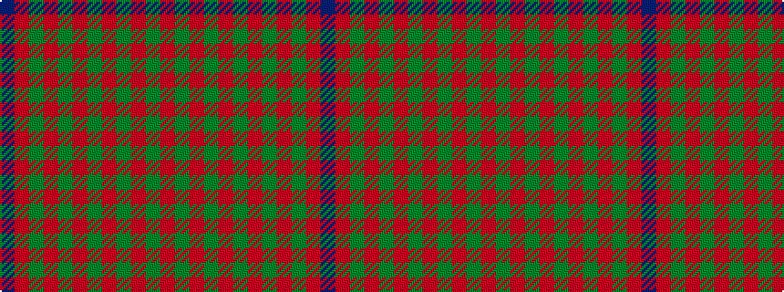

BRGRGRGRGRGR

It is a 12 stripe tartan.

<figure class="pat-woven">

<figcaption>idealised sample</figcaption>
</figure>

## Colour Sequence



## Tartans with this colour sequence

| Tartans |
|---------------|
| [Skene #2](/variants/s12/db6r3g1r3g12r3g1~x4/)|
||
