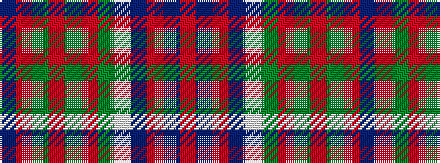

BRGRGRGWBRBR

It is a 12 stripe tartan.

<figure class="pat-woven">

<figcaption>idealised sample</figcaption>
</figure>

## Colour Sequence



## Tartans with this colour sequence

| Tartans |
|---------------|
| [Raibert, Check](/setts/s12/db3o14g2o2g2o3g6w18db3o2db2o2~x2/)|
||
