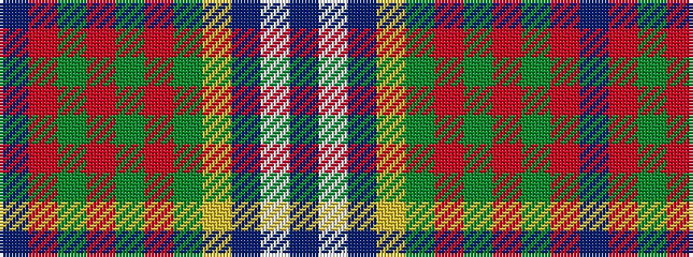

BRGRGRGYBWB

It is a 11 stripe tartan.

<figure class="pat-woven">

<figcaption>idealised sample</figcaption>
</figure>

## Colour Sequence



## Tartans with this colour sequence

| Tartans |
|---------------|
| [Currie](/setts/s11/db16w3db1ly4g24r1g3r4g3r1t8~x2/)|
||
