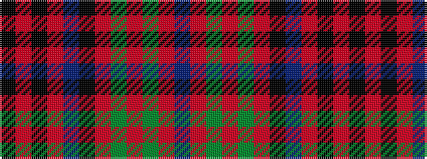

BRGRGRKBRKRK

It is a 12 stripe tartan.

<figure class="pat-woven">

<figcaption>idealised sample</figcaption>
</figure>

## Colour Sequence



## Tartans with this colour sequence

| Tartans |
|---------------|
| [Bates](/setts/s12/k6r3k3r24t4k10r2g4r2g24r6t2~x2/)|
||
