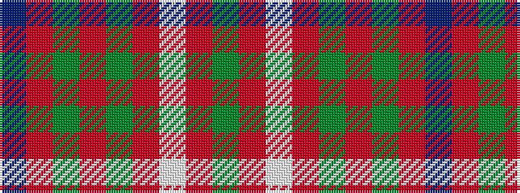

BRGRGRWRG

It is a 9 stripe tartan.

<figure class="pat-woven">

<figcaption>idealised sample</figcaption>
</figure>

## Colour Sequence



## Tartans with this colour sequence

| Tartans |
|---------------|
| [Redwood Dress](/variants/s9/dg3r1w5r1dg2r1dg1r9do2~x4/)|
||
