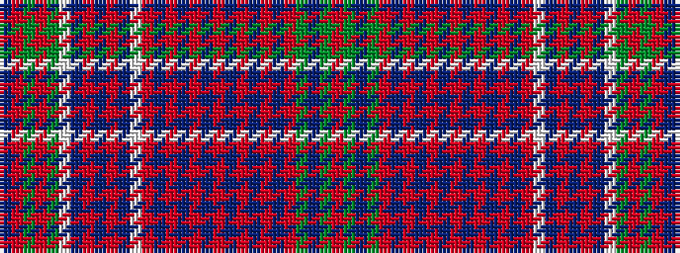

BRGRGWBRBRBWRBRBRBRBRBRBRGBGR

It is a 29 stripe tartan.

<figure class="pat-woven">

<figcaption>idealised sample</figcaption>
</figure>

## Colour Sequence



## Tartans with this colour sequence

| Tartans |
|---------------|
| [Summerville Presbyterian Church (Cor](/setts/s29/db3r15g2r2g12w2db12r2db4r2db12w2r8db2r2db2r2db2r8db2r2db2r2db2r8g10db1g2r2~x2/)|
||
