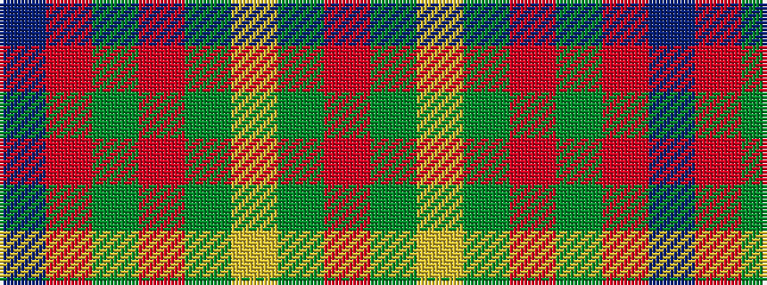

BRGRGYGR

It is a 8 stripe tartan.

<figure class="pat-woven">

<figcaption>idealised sample</figcaption>
</figure>

## Colour Sequence



## Tartans with this colour sequence

| Tartans |
|---------------|
| [Burnett](/variants/s8/r2g6ly1g6r3g2r16db1~x4/)|
||
| [Burnett of Leys Family Tartan](/variants/s8/r2g6ly1g6r3g2r16t1~x4/)|
||
| [Burnett of Powis (Personal)](/variants/s8/r3y19ly3y19r3y3r21t3~x2/)|
||
