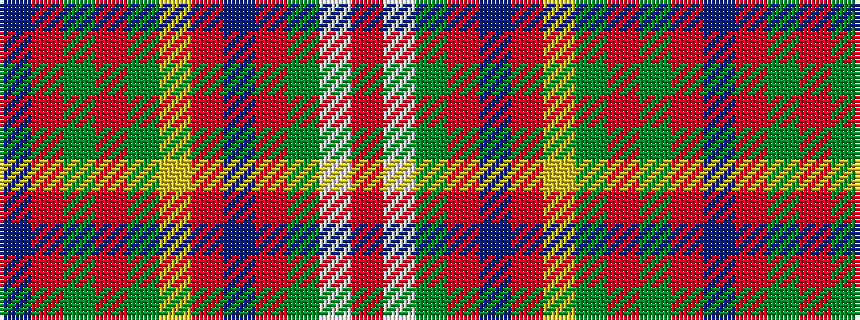

BRGRGYRBRGWR

It is a 12 stripe tartan.

<figure class="pat-woven">

<figcaption>idealised sample</figcaption>
</figure>

## Colour Sequence



## Tartans with this colour sequence

| Tartans |
|---------------|
| [Michael from Appin (Personal)](/setts/s12/db4r24dg2r3dg19ly2r2db8r2dg2w2r2~x2/)|
||
