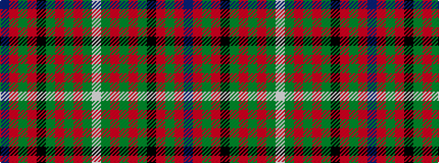

BRGRKGRGRGW

It is a 11 stripe tartan.

<figure class="pat-woven">

<figcaption>idealised sample</figcaption>
</figure>

## Colour Sequence



## Tartans with this colour sequence

| Tartans |
|---------------|
| [Ronald, Clan (Clan)](/variants/s11/db2r1g10r1k6g12r2g1r1g3w2~x4/)|
||
