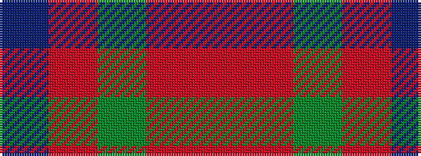

BRGRR

It is a 5 stripe tartan.

<figure class="pat-woven">

<figcaption>idealised sample</figcaption>
</figure>

## Colour Sequence



## Tartans with this colour sequence

| Tartans |
|---------------|
| [Moray of Abercairney](/setts/s5/r8r1g4r1db4~x2/)|
||
| [Moray of Abercairney #2](/setts/s5/r8r1dg4r1db4~x2/)|
||
