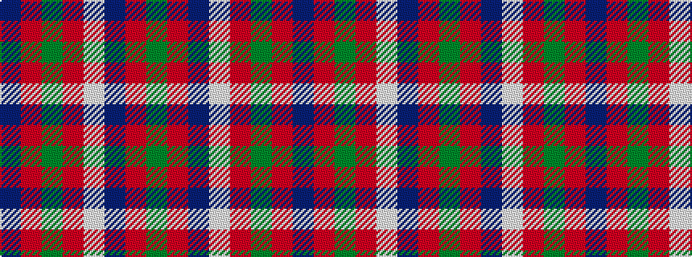

BRGRWBRG

It is a 8 stripe tartan.

<figure class="pat-woven">

<figcaption>idealised sample</figcaption>
</figure>

## Colour Sequence



## Tartans with this colour sequence

| Tartans |
|---------------|
| [New Glasgow (Canada)](/variants/s8/dg28r4db25w5r22dg27r4db2~x2/)|
||
| [New Glasgow (Canada)](/variants/s8/dg28r4dp25w5r22dg27r4dp2~x2/)|
||
