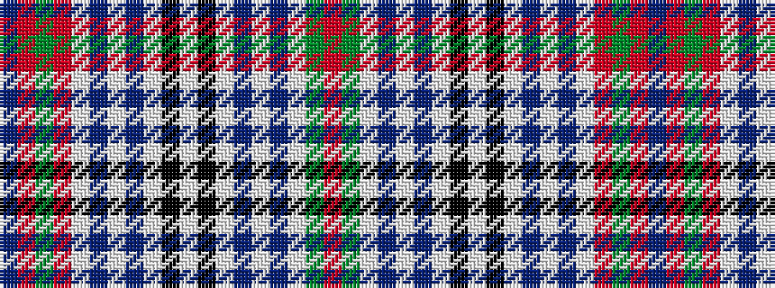

BRGRWBWBWKWKWBWBWGR

It is a 19 stripe tartan.

<figure class="pat-woven">

<figcaption>idealised sample</figcaption>
</figure>

## Colour Sequence



## Tartans with this colour sequence

| Tartans |
|---------------|
| [Metcalf (Clan)](/setts/s19/r44g18lb5dt2lb2dt3lb9k7lb5k7lb9dt3lb2dt2lb5r16g3r5dt2~x2/)|
||
