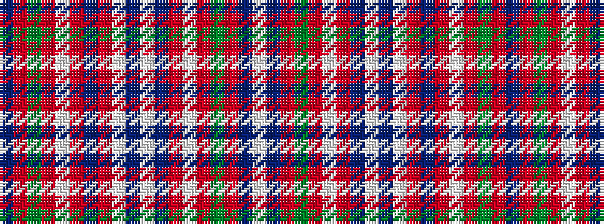

BRGRWRBRWBWBRWRGRBW

It is a 19 stripe tartan.

<figure class="pat-woven">

<figcaption>idealised sample</figcaption>
</figure>

## Colour Sequence



## Tartans with this colour sequence

| Tartans |
|---------------|
| [Unidentified Scarlett #11](/setts/s19/b5r30g26r5w1r5b32r30lb1b3lb1b31r5w1r5g26r32b5w1~x2/)|
||
