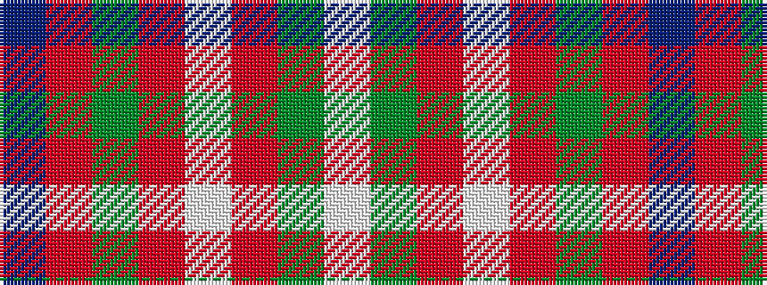

BRGRWRGW

It is a 8 stripe tartan.

<figure class="pat-woven">

<figcaption>idealised sample</figcaption>
</figure>

## Colour Sequence



## Tartans with this colour sequence

| Tartans |
|---------------|
| [Robertson Dress (Dalgleish) #2](/setts/s8/db24r4g24r4w20r10g3w4~x2/)|
||
