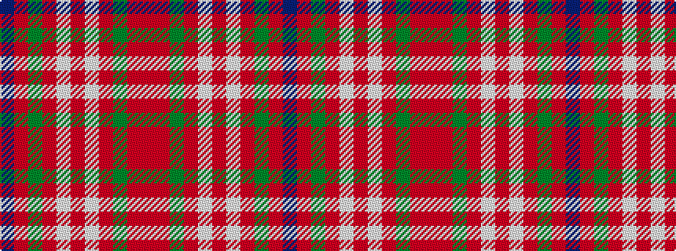

BRGRWRWRGRR

It is a 11 stripe tartan.

<figure class="pat-woven">

<figcaption>idealised sample</figcaption>
</figure>

## Colour Sequence



## Tartans with this colour sequence

| Tartans |
|---------------|
| [Fraser hunting, dress](/variants/s11/db4o24g17o3w18o3w18o3g17o24r4~x2/)|
||
