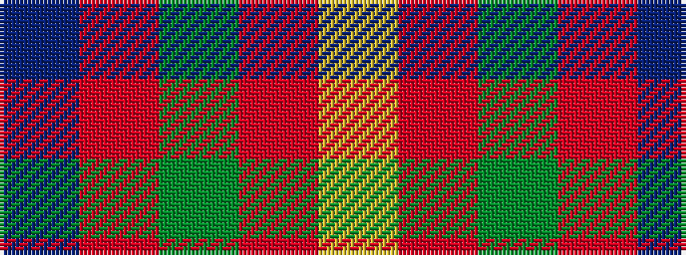

BRGRY

It is a 5 stripe tartan.

<figure class="pat-woven">

<figcaption>idealised sample</figcaption>
</figure>

## Colour Sequence



## Tartans with this colour sequence

| Tartans |
|---------------|
| [Dunoon Burgh Hall Trust](/variants/s5/db2m3g3o6ly2~x2/)|
||
