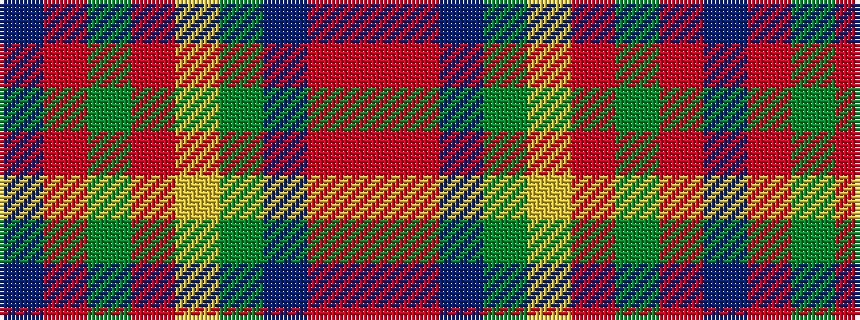

BRGRYGBRR

It is a 9 stripe tartan.

<figure class="pat-woven">

<figcaption>idealised sample</figcaption>
</figure>

## Colour Sequence



## Tartans with this colour sequence

| Tartans |
|---------------|
| [Aberdeen Mither Kirk (St Nicholas)](/variants/s9/dt58o3y16r3lo2y7dt29r3o2~x2/)|
||
