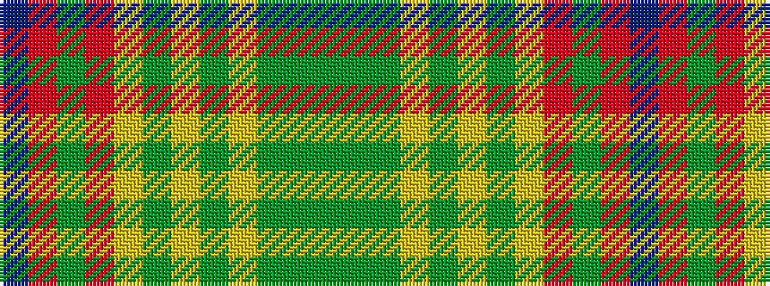

BRGRYGYGYGGG

It is a 12 stripe tartan.

<figure class="pat-woven">

<figcaption>idealised sample</figcaption>
</figure>

## Colour Sequence



## Tartans with this colour sequence

| Tartans |
|---------------|
| [Harmony 1](/variants/s12/dy11dg3dy4ly3dy3ly4dy3lo13o34dg3o4dr3~x2/)|
||
