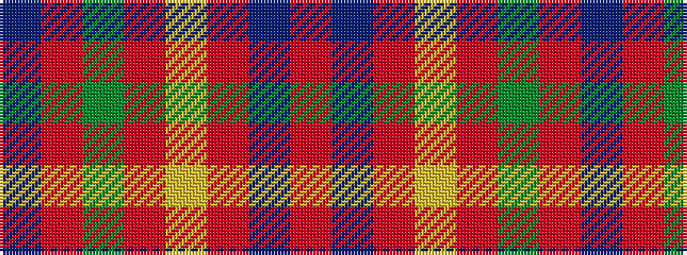

BRGRYRBR

It is a 8 stripe tartan.

<figure class="pat-woven">

<figcaption>idealised sample</figcaption>
</figure>

## Colour Sequence



## Tartans with this colour sequence

| Tartans |
|---------------|
| [De Nardi #2 (Personal)](/variants/s8/r68db27r5ly3r5g3r13t3~x2/)|
||
