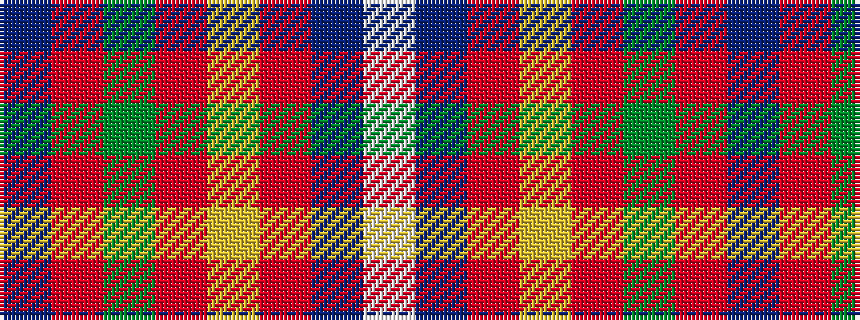

BRGRYRBW

It is a 8 stripe tartan.

<figure class="pat-woven">

<figcaption>idealised sample</figcaption>
</figure>

## Colour Sequence



## Tartans with this colour sequence

| Tartans |
|---------------|
| [De Maynard (Personal)](/setts/s8/dp2o9g8o4ly1o4db10w2~x4/)|
||
