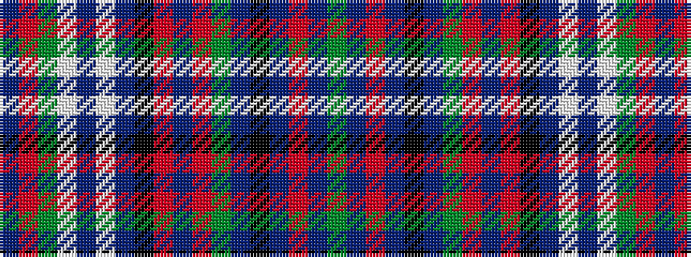

BRGWBWBKRBRGBKBRBG

It is a 18 stripe tartan.

<figure class="pat-woven">

<figcaption>idealised sample</figcaption>
</figure>

## Colour Sequence



## Tartans with this colour sequence

| Tartans |
|---------------|
| [Cooper Dress (Dalgleish #2) (Dance)](/setts/s18/dy2db2r4db21k1db1g9r3db2r3k10db3w2db3w28dy2r4db2~x2/)|
||
