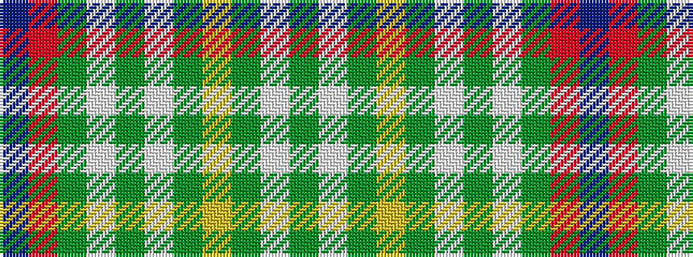

BRGWGWGYGWG

It is a 11 stripe tartan.

<figure class="pat-woven">

<figcaption>idealised sample</figcaption>
</figure>

## Colour Sequence



## Tartans with this colour sequence

| Tartans |
|---------------|
| [Greyfriars (District)](/setts/s11/b30r6dy16lp6g10lp14g24ly4dy10lp3dy28/)|
||
