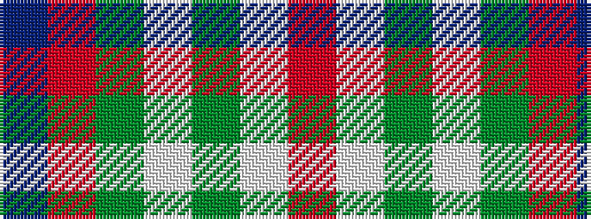

BRGWGWR

It is a 7 stripe tartan.

<figure class="pat-woven">

<figcaption>idealised sample</figcaption>
</figure>

## Colour Sequence



## Tartans with this colour sequence

| Tartans |
|---------------|
| [Chambers, Christopher J (Personal)](/variants/s7/t16r1g16w1dy1w8m3~x2/)|
||
