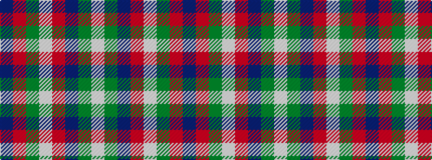

BRGWRBGW

It is a 8 stripe tartan.

<figure class="pat-woven">

<figcaption>idealised sample</figcaption>
</figure>

## Colour Sequence



## Tartans with this colour sequence

| Tartans |
|---------------|
| [James of Glencarr (Personal)](/variants/s8/db8r8dg17w3r35db10dg15w3~x2/)|
||
