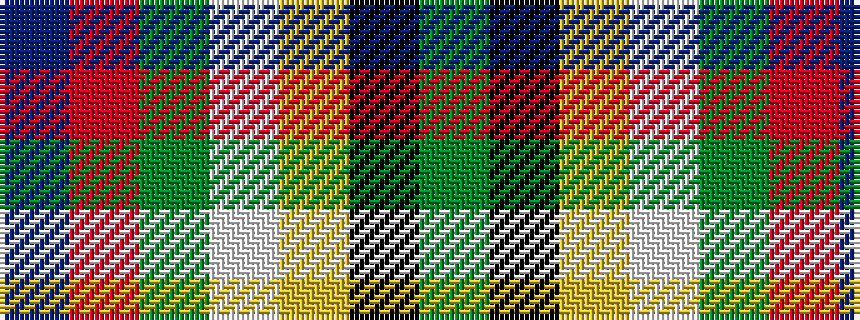

BRGWYKG

It is a 7 stripe tartan.

<figure class="pat-woven">

<figcaption>idealised sample</figcaption>
</figure>

## Colour Sequence



## Tartans with this colour sequence

| Tartans |
|---------------|
| [Crofters (Personal)](/setts/s7/db20r2g9w6ly4k2g8~x2/)|
||
