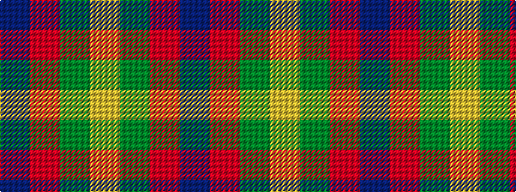

BRGY

It is a 4 stripe tartan.

<figure class="pat-woven">

<figcaption>idealised sample</figcaption>
</figure>

## Colour Sequence



## Tartans with this colour sequence

| Tartans |
|---------------|
| [Barber Family (Personal)](/variants/s4/ly30g30r1db16~x2/)|
||
| [Wilson's No.203](/variants/s4/t2r4g5ly1~x4/)|
||
