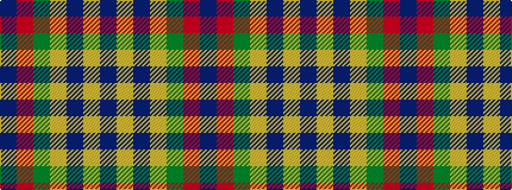

BRGYBYB

It is a 7 stripe tartan.

<figure class="pat-woven">

<figcaption>idealised sample</figcaption>
</figure>

## Colour Sequence



## Tartans with this colour sequence

| Tartans |
|---------------|
| [Logan #3](/variants/s7/dp9lr4dp1lr4g15r4dp1~x4/)|
||
