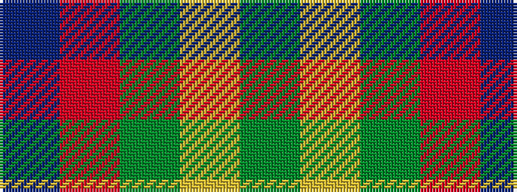

BRGYG

It is a 5 stripe tartan.

<figure class="pat-woven">

<figcaption>idealised sample</figcaption>
</figure>

## Colour Sequence



## Tartans with this colour sequence

| Tartans |
|---------------|
| [Unidentified, Silk Plaid](/variants/s5/db7o8g15ly6y3~x10/)|
||
