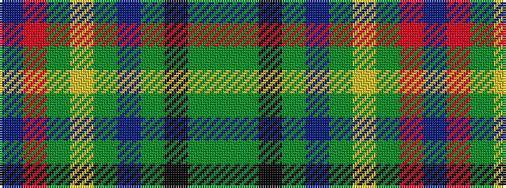

BRGYGBGKGG

It is a 10 stripe tartan.

<figure class="pat-woven">

<figcaption>idealised sample</figcaption>
</figure>

## Colour Sequence



## Tartans with this colour sequence

| Tartans |
|---------------|
| [State Seal of Missouri (Fashion)](/setts/s10/b6r7dy49lo2dy22b10dy5k5dy8g4~x2/)|
||
