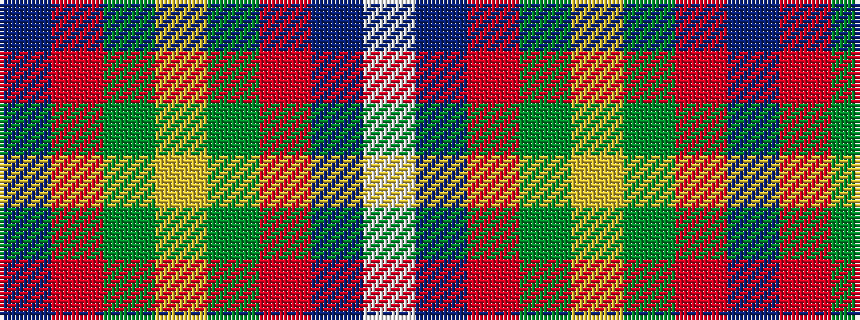

BRGYGRBW

It is a 8 stripe tartan.

<figure class="pat-woven">

<figcaption>idealised sample</figcaption>
</figure>

## Colour Sequence



## Tartans with this colour sequence

| Tartans |
|---------------|
| [Forrester (James) (Personal)](/setts/s8/db16r14g16ly3g16r14db16w3~x2/)|
||
