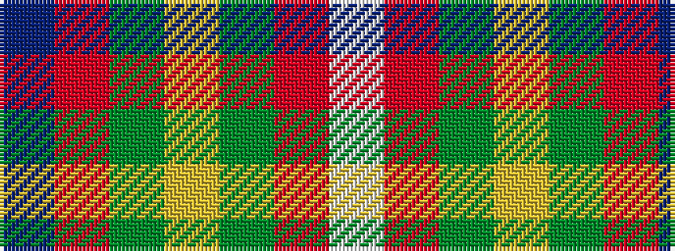

BRGYGRW

It is a 7 stripe tartan.

<figure class="pat-woven">

<figcaption>idealised sample</figcaption>
</figure>

## Colour Sequence



## Tartans with this colour sequence

| Tartans |
|---------------|
| [Buchanhaven Heritage](/setts/s7/t24r27g20lo6g20r2w3~x2/)|
||
